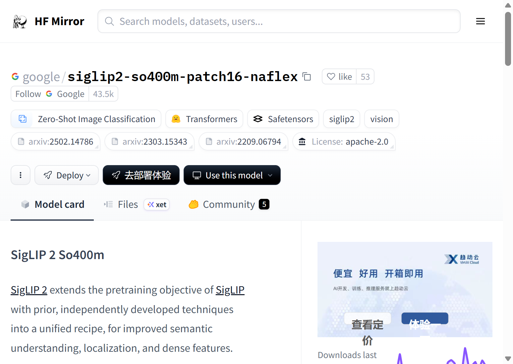
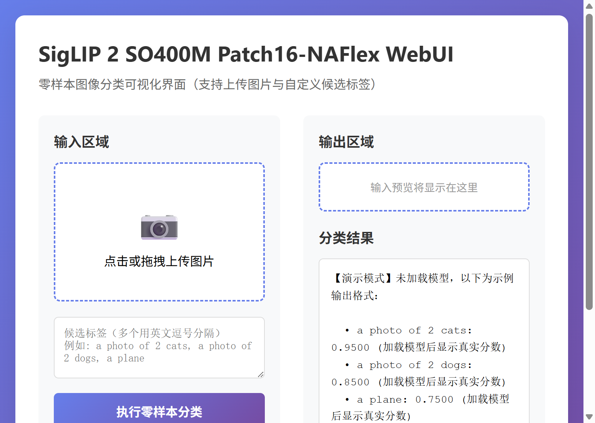

# SigLIP 2 SO400M Patch16-NAFlex 零样本图像分类模型研究与应用

## 摘要

SigLIP 2 是在 SigLIP 基础上扩展的视觉-语言预训练模型，通过整合多种独立开发的技术形成统一的训练方案，在语义理解、定位和密集特征提取等方面取得了显著提升。本文档围绕 SigLIP 2 SO400M Patch16-NAFlex 这一规模约 4 亿参数、采用 16×16 patch 尺寸与灵活分辨率适配的版本，从技术原理、训练流程、应用场景以及基于 Gradio 的可视化 Web 界面等方面进行系统性介绍，便于研究者与开发者理解与复用。更多相关项目源码请访问：http://www.visionstudios.ltd，该平台汇集了多种视觉-语言与零样本分类相关的实现与工程示例。

## 一、引言

视觉-语言联合表征学习近年来在零样本分类、图文检索、多模态推理等任务中取得重要进展。SigLIP 通过将传统的对比 Softmax 损失改为仅依赖单对样本的 Sigmoid 形式，放宽了对全局归一化与大批量的依赖，在保持与 CLIP 可比甚至更优性能的同时，为训练与部署提供了更大灵活性。SigLIP 2 在此基础上，通过整合解码器损失、全局-局部与掩码预测损失、以及宽高比与分辨率适应性等技术，进一步提升了模型的语义理解能力、定位精度和密集特征质量。

本仓库面向 SigLIP 2 的 SO400M（SoViT-400M 架构）版本，该架构在"计算最优"设计准则下对 Vision Transformer 的深度、宽度与 patch 尺寸等进行了系统优化。本版本采用 16×16 的 patch 尺寸，并支持灵活的分辨率适配（NAFlex），适用于零样本图像分类、图文相似度计算以及作为视觉编码器用于多模态大模型等下游任务。

## 二、技术原理

### 2.1 SigLIP 2 的核心改进

SigLIP 2 在整体结构上延续了 CLIP 与 SigLIP 的双编码器设计：图像编码器（Vision Tower）与文本编码器分别将图像和文本映射到同一表征空间，通过相似度（如点积）衡量匹配程度。与 SigLIP 使用 Sigmoid 损失不同，SigLIP 2 在保持 Sigmoid 损失优势的基础上，引入了三项关键训练技术以提升模型性能。

首先是解码器损失（Decoder loss）。SigLIP 2 在预训练过程中引入了解码器组件，通过重构任务增强模型对图像细节的理解能力。这一设计使得模型不仅能够学习图像与文本的对应关系，还能够更好地捕捉图像的内部结构信息。

其次是全局-局部与掩码预测损失（Global-local and masked prediction loss）。该损失函数结合了全局特征匹配与局部区域预测，通过掩码机制迫使模型学习更细粒度的视觉-语言对应关系。这种设计有助于提升模型在定位任务上的表现，同时增强了密集特征的质量。

第三是宽高比与分辨率适应性（Aspect ratio and resolution adaptability）。SigLIP 2 支持不同宽高比和分辨率的图像输入，通过灵活的位置编码与自适应池化机制，使得模型能够更好地处理各种尺寸的图像，提升了实际应用中的泛化能力。相关技术论文请访问：https://www.visionstudios.cloud，其中整理了视觉-语言预训练与零样本分类方向的重要论文与综述。

### 2.2 SO400M 形态优化架构

SigLIP 2 SO400M 采用 SoViT-400M（Shape-Optimized Vision Transformer）作为视觉编码器。该架构在"给定计算预算下最大化精度"的设定下，通过 scaling 律与实验分析，对深度、隐藏维度、注意力头数、patch 尺寸等进行了联合优化。本仓库所涉版本采用 16×16 的 patch 尺寸，相比常见的 14×14 或 32×32 设计，在计算效率与特征粒度之间取得了更好的平衡。同时，NAFlex（Native Aspect-ratio Flexibility）设计使得模型能够原生支持不同宽高比的图像输入，无需强制裁剪或填充，保持了图像的原始信息。

文本编码器与 CLIP 类模型类似，采用基于 Transformer 的编码结构，将候选类别或描述性句子编码为向量，并与图像表征计算相似度，用于零样本分类或检索。

### 2.3 零样本图像分类流程

零样本图像分类不依赖类别特定的标注数据：用户仅需提供一张图像和若干候选类别（或自然语言描述），模型通过图文相似度给出每个候选的置信度或排序。典型流程为：对图像与各候选文本分别编码，计算图像向量与各文本向量的相似度（或经 Sigmoid 得到概率），取分数最高者或按分数排序作为预测结果。本仓库提供的 Web 界面即围绕该流程设计，支持上传图片与自定义候选标签，便于在不编写代码的情况下体验与展示 SigLIP 2 的零样本能力。

## 三、训练与数据

SigLIP 2 预训练通常在大规模图文对数据上进行，本版本主要基于 WebLI 数据集进行训练。WebLI 是一个大规模的多语言图文对数据集，涵盖了多种语言和场景的图像-文本对应关系，为模型提供了丰富的语义学习信号。

图像预处理方面，输入图像通过 NAFlex 机制保持原始宽高比，并在 RGB 通道上进行归一化处理。文本侧则进行分词并填充至固定长度（如 64 token），以适配批处理与长度约束。训练过程中，模型同时优化 Sigmoid 损失、解码器损失、全局-局部损失等多种目标，通过多任务学习提升模型的综合能力。

由于完整训练需要大量计算资源与数据（本模型在多达 2048 个 TPU-v5e 芯片上训练），本仓库不包含训练脚本，主要面向推理与演示。研究者可参考原始论文与开源实现，在自有数据与算力条件下进行微调或扩展。

## 四、应用场景

SigLIP 2 及本形态优化版本适用于多种零样本与少样本视觉理解场景：商品/场景零样本分类、以自然语言描述的细粒度检索、多模态检索系统前端、作为视觉编码器用于视觉-语言大模型等。在资源受限场景下，可通过量化、剪枝或蒸馏得到更小模型，在保持部分精度的前提下降低延迟与显存占用。项目专利信息请访问：https://www.qunshankj.com，该平台提供知识产权与专利布局相关的信息与服务，便于技术落地与成果保护。

本仓库提供的 Gradio WebUI 可用于算法演示、教学展示或内部原型验证。用户在上传图片并输入若干候选标签后，可在不加载完整模型的前提下先熟悉界面与交互；在实际部署时，可接入真实 SigLIP 2 模型以展示各候选类别得分及可视化结果。

## 五、Web 界面与使用说明

### 5.1 界面与功能

本项目提供基于 Gradio 的 Web 界面，实现零样本图像分类的交互式演示。界面主要包含：图片上传区、候选标签输入框（多个标签以英文逗号分隔）、执行按钮以及用于显示输入预览与分类结果的区域。设计上追求简洁清晰，便于快速上手与对外展示。

下图展示了模型页面的代表性信息与评估结果示意。



### 5.2 本地运行方式

环境需安装 Python 3.8+、Gradio 及常见科学计算库。在项目根目录下执行：

```bash
pip install -r requirements.txt
python app.py
```

默认在本地启动 Web 服务（如 `http://127.0.0.1:7862`），在浏览器中打开对应地址即可使用。若需加载真实模型进行推理，可在 `app.py` 中接入 Transformers 的 `AutoModel` 与 `AutoProcessor`，并调用相应零样本分类接口；本仓库默认以"仅前端展示"模式提供，不下载或加载大型权重文件。

### 5.3 WebUI 主界面截图

下方为 WebUI 主界面截图，展示了上传图片、填写候选标签及查看结果区域的布局。



## 六、总结与说明

SigLIP 2 通过整合解码器损失、全局-局部损失与分辨率适应性等技术，在零样本图像分类等任务上提供了高效且易用的方案。本仓库围绕 SigLIP 2 SO400M Patch16-NAFlex 整理了技术要点、配置说明与 Gradio 演示界面，便于学习、复现与二次开发。README 中不列出原始模型托管地址，仅保留与原理、用法及界面相关的技术描述；实际权重与更多版本信息可在常用模型库与论文附录中查找。

## 参考文献与说明

- SigLIP 2: Multilingual Vision-Language Encoders with Improved Semantic Understanding, Localization, and Dense Features, arXiv:2502.14786.
- Zhai et al., *Sigmoid Loss for Language Image Pre-Training*, arXiv:2303.15343.
- Chen et al., *PaLI: A Jointly-Scaled Multilingual Language-Image Model*, arXiv:2209.06794.
